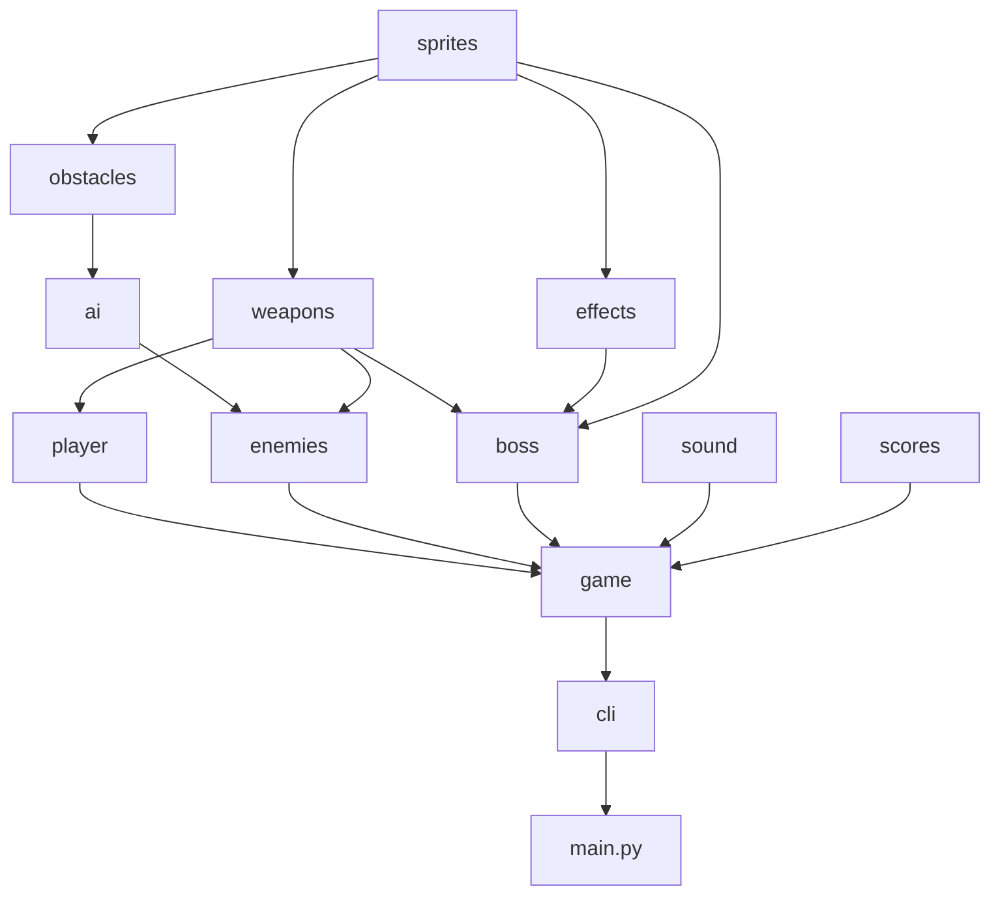

# Architecture

## Project layout

```
main.py                 launcher: native loop, or async loop in the browser
nova_strike/
    config.py           settings, tuning tables and shared types
    gfx.py              drawing and geometry helpers
    sound.py            sound synthesis and playback
    sprites.py          sprite artwork and the loaded sprite registry
    effects.py          stars, particles, shockwaves, floating text
    weapons.py          bullets, homing missiles, power-ups
    obstacles.py        asteroids, walls, laser gates, mines, spinners
    player.py           the player's ship and weapon inventory
    ai.py               enemy obstacle avoidance
    enemies.py          enemy ships and how they're chosen
    boss.py             the mothership boss
    scores.py           the high score table
    game.py             the Game class: state, loop, collisions, drawing, input
    cli.py              command-line options and entry points
tests/                  pytest unit tests
scripts/                web build and browser check
docs/                   documentation
```

## Module dependencies

Each module imports only modules listed above it in the layout, so there are no import cycles. Every module
uses `config`, and most use `gfx`; leaving those two out, the runtime imports are:



An arrow means "is used by". `obstacles.py` and `boss.py` refer to `Game` only in type hints, imported under
`TYPE_CHECKING`, so they don't import `game` at runtime.

## The game loop

`Game.frame()` runs one frame:

1. Handle input events (`handle_key`).
2. Adapt to a resized window (`fit_to_window`).
3. Update the game (`update`).
4. Draw it (`draw`, then `present`, which scales the picture to the window).

`Game.run()` calls it in a loop natively. `Game.run_async()` does the same in the browser, awaiting
`asyncio.sleep(0)` after each frame so the page stays responsive.

`Game.state` is one of `title`, `playing`, `paused`, `enter_name` or `game_over`.

### One update

`Game.update(dt, keys)` does the following while playing:

- **Time.** Slow motion splits time in two. The player's ship, shots, laser and timers use real time (`dt`).
  Everything else (enemies, enemy fire, barriers, asteroids, power-ups, background) uses world time (`wdt`),
  which is `dt × SLOWMO_FACTOR` during slow motion.
- **Levels and the boss.** The level follows the score. At a boss level a warning starts; when it ends the
  `Boss` is created. While the boss is around, levels don't advance and normal enemies and barriers stop.
- **The player.** Move, then fire: projectiles from `Player.fire`, or the beam from `Game.update_laser`.
- **Spawning.** Enemies on a timer; barriers and asteroids from `spawn_obstacles` and `spawn_barrier`, kept
  apart so an asteroid never blocks a gap; power-ups on their own timer. Spawn rates scale with the playfield
  width.
- **Movement.** Every object updates. Each enemy first asks `ai.plan_route` how to fly.
- **Collisions.** `handle_collisions` resolves shots against enemies, the boss, enemy missiles, asteroids,
  walls and hazards; enemy fire against barriers; enemies against barriers; and the player against everything.
- **Clean-up.** Dead objects are removed, and an extra life is awarded if earned.

## Entities

There's no class hierarchy for game objects. Each class has the fields and methods its role needs:

- Most have `update(dt)`, `draw(surface)`, a position (`x`, `y`) and an `alive` flag.
- Things that can be hit have `hit(damage) -> destroyed`, and a `hitbox()` or `hits_rect(rect)`.
- Hazards (`LaserGate`, `Mine`, `Spinner`) share an interface the game relies on: `update(dt, game)`,
  `touches(rect)`, `blocks(rect)` and `laser_stop(x, half_width, top)`. `Hazard` is the type covering all three.
- Walls are kept separately from hazards: they span the screen and are described by solid `segments`.
  `SlidingWall` moves its gap.

`Player` keeps an `arsenal` of `WeaponSlot`s (level and ammo; the blaster's ammo is `None`, meaning unlimited)
and the `selected` weapon.

Shared types such as `Color`, `Point`, `EnemySpec` and `KeyState`, and the protocols `Target` and `HasY`, are in
`config.py`.

## Enemy obstacle avoidance

`ai.plan_route(enemy, walls, hazards, asteroids)` returns a `Plan`: a sideways `target_x` (or `None` to weave
normally) and a `speed_scale`. `Enemy.update` follows it, steering sideways at most at its `agility`.

Planning is based on `crossing_window`, which works out when two things moving down the screen at different
speeds will overlap vertically. That includes barriers scrolling faster than a slow enemy and catching it from
behind.

1. If a wall will be met within `LOOKAHEAD` (1.6 s) and the enemy isn't lined up with a gap, the planner tries
   speeds in order of preference over `PLAN_HORIZON` (4 s). It picks the first speed at which the nearest gap
   can be reached before the wall arrives and every laser gate is off when crossed. If none works, it picks the
   speed that buys the most time.
2. Otherwise it picks the most natural speed that crosses laser gates while they're off, and sidesteps the
   soonest asteroid, mine (allowing for the blast) or spinner in its path.

Walls and gates can predict their own future (`Wall.segments_at(ahead)`, `LaserGate.state(ahead)`), which makes
sliding gaps and gate timing possible.

## Damage rules

The player and enemies take barrier damage under the same rules. `Game.damage_enemy(enemy, amount)` takes the
amount the player would lose out of `PLAYER_MAX_HEALTH` and removes the same share of the enemy's health. Both
are then protected for `HIT_INVULN` seconds. An enemy destroyed this way gives no points.

## Graphics

- **Sprites** are drawn in code at 4× size (`SS`) and smoothly scaled down for clean edges (`build_sprite`).
  `load_sprites` builds them all at startup into `SPRITES`, with several random shapes per asteroid size in
  `ASTEROID_SPRITES`.
- **Glows** are radial gradients drawn with additive blending (`glow_surface`, `blit_glow`) and cached by size
  and colour.
- **Hit flashes** use a white copy of each sprite (`make_flash`).

### Resizing and fullscreen

The playfield is always 720 units tall. Its width, `config.WIDTH`, follows the window's shape (between 480 and
`MAX_WIDTH`), so a fullscreen widescreen window gets a wider playfield rather than black bars.

`Game.set_play_width` changes the width and moves everything in flight across in proportion. Each frame is drawn
at playfield size and then scaled to the window by `Game.present`. Code must read the width as `config.WIDTH`
so it always gets the current value.

## Sound

Every sound is synthesised when sound is first enabled, by `build_sound_samples` in `sound.py`. Sounds are built
from oscillators (`tone`), filtered noise (`noise`) and silence, combined with `mix` and `concat`. `SoundFX`
converts them to the mixer's format (16-bit, or 32-bit float in the browser; mono or stereo). It also stops the
same sound playing more often than every few hundredths of a second, and loops the laser hum while it's firing.

If there's no audio device, the game runs silently.

## High scores

`scores.py` loads and saves the top 10 as JSON: to `config.SCORES_FILE` natively, or to the browser's local
storage on the web. The path is read when the game runs (not fixed when the code loads), so tests can redirect
it. A missing or damaged file falls back to the default table. Runs started with `--level` or `--boss-level` are
"practice" runs and are never recorded.
